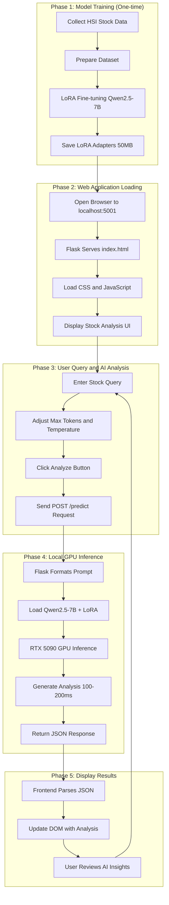

<div align="center">
  
</div>

## AI-Powered Stock Movement Predictor for Hang Seng Index (HSI) Companies: <p> Locally Deployed Fine-tuned Qwen2.5-7B with LoRA on RTX 5090 GPU

[](https://www.python.org/)
[](https://pytorch.org/)
[](https://developer.nvidia.com/cuda)
[]()
[](https://www.docker.com/)
[](LICENSE)

## 📊 Overview

> **Not your typical financial strategic decision assistant app!**

**JeffreyWoo HSI Stock Predictor** is a **locally deployed** AI-powered financial strategic decision assistant app that runs entirely on your own hardware. It fine-tunes large language model (e.g. Qwen2.5-7B) with Low-Rank Adaptation (LoRA) running on high-performance GPUs (e.g. NVIDIA RTX 5090 GPU) for Hang Seng Index (HSI) company analysis without relying on cloud APIs, external databases or services, ensuring that your data stays secure and never leaves your computer. It is designed to help businesses and professionals make smarter, faster and more confident financial choices.

**⚠️ Note:** This repository contains **only code and documentation** (no pre-trained model weights). Model weights are excluded due to GitHub's 100 MB file size limit. You can train your own model using the provided scripts.

## ✨ What It Does
- 📊 **Real-Time Market Intelligence** — analyze complex financial data and Hang Seng Index (HSI) market trends using predictive AI models, providing timely insights for investment and risk management
- 🧠 **AI-Powered Strategic Guidance** — deliver actionable recommendations for portfolio optimization, risk mitigation and strategic decision‑making, tailored to finance professionals
- 🌍 **Hong Kong Stock Market Focus** — provide specialized analysis tailored to equities and financial trends in Hong Kong stock market, strengthening regional investment strategies
- 🔒 **Secure & Scalable Deployment** — built with reproducible workflows and scalable architecture, ensuring privacy, reliability and enterprise‑grade performance
- ⚙️ **Customizable AI Parameters** — allow users to adjust max tokens and temperature settings, fine‑tuning AI outputs for either more precise or more creative financial insights

## 🎛️ Impacts of Max Tokens & Temperature on Analysis Results

The web interface allows you to adjust two key parameters (Max Tokens & Temperature) that influence how the AI generates stock analysis:

### 📝 Max Tokens
Controls how long the AI's response can be.

| Setting | Effect | 
|---------|--------|
| Low (50-100) | Short, concise answers. Quick summary, less detail. "Bullish. Target HKD 395."| 
| Medium (200-300) | Balanced. Includes reasoning + recommendation. "Based on RSI 65 and strong gaming revenue, Tencent shows bullish momentum. Target HKD 395."| 
| High (400-500) | Long, detailed analysis. Includes multiple factors, risk assessment and caveats.| 

**Reason:** A stock analysis needs enough space to explain why a prediction is made. Too few tokens = missing reasoning. Too many = unnecessary verbosity.

### 🌡️ Temperature
Controls how "creative" vs "conservative" the AI is.

| Setting | Effect | 
|---------|--------|
| Low (0.1-0.3) | Conservative, predictable, factual. Same input → similar output. Safe for consistent analysis.| 
| Medium (0.5-0.8) | Balanced creativity. Varies phrasing but stays grounded. Recommended for most financial analysis.| 
| High (0.9-1.5) | Creative, varied responses. Different wording each time. Can introduce novel insights but risks less reliable outputs.| 

**Reason:** Financial analysis needs consistency. Low temperature ensures the AI doesn't hallucinate or give wildly different advice for the same data. Higher temperature can be useful for exploring alternative scenarios or brainstorming.

**⚠️ Note:** *"Temperature"* refers to AI response creativity, not GPU hardware temperature. GPU temperature is managed automatically by your computer.

## 💡 Finance Transformation Impact
- Modernizing financial workflows with AI‑driven predictive modeling and real‑time market insights
- Empowering decision‑makers through scenario simulations and confidence scoring on HSI predictions
- Strengthening risk management with GPU‑accelerated forecasting tools that run entirely on local hardware
- Driving transformation by aligning AI‑powered analytics with organizational strategy and compliance needs
- Promoting responsible innovation with secure, **local deployment** that keeps sensitive financial data private

## 🚀 Why Choose JeffreyWoo HSI Stock Predictor
Most tools just crunch numbers. **JeffreyWoo HSI Stock Predictor** goes further — embedding AI into your decision-making process so you can anticipate risks, seize opportunities, and align financial strategies with long-term goals.

## 💰 Modeling & AI Techniques Applied
This app leverages AI and machine learning (ML) methods to automate analysis of Hang Seng Index (HSI) stock movements, and generate predictive insights:
- **LoRA Fine‑Tuning** — parameter‑efficient adaptation of Qwen2.5‑7B for financial text and time‑series data
- **Transformer‑Based Language Modeling** — contextual understanding of financial news, market sentiment and structured datasets
- **Time‑Series Forecasting** — integration of historical HSI data for directional movement prediction
- **Sentiment Analysis** — parsing financial headlines and reports to detect bullish/bearish signals
- **Feature Engineering** — combining technical indicators (moving averages, candlesticks, volatility measures) with textual features
- **Scenario Simulation** — generating “what‑if” outcomes based on market conditions and model predictions
- **Confidence Scoring** — probabilistic outputs to quantify prediction reliability
- **GPU‑Accelerated Inference** — optimized deployment on NVIDIA RTX 5090 with CUDA 12.8 + PyTorch 2.7.1

## 🔧 Understanding LLM Fine-Tuning for Financial Applications

### 🤔 What is LLM Fine-Tuning?
Large Language Models (LLMs) like Qwen2.5-7B are pre-trained on massive, general-purpose text datasets (books, websites, code). Fine-tuning is the process of adapting these general-purpose models to excel at specific tasks—in this project, Hang Seng Index stock analysis.

Think of it like hiring a brilliant generalist (the base model) and giving them specialized training to become a financial analyst. The base model already understands language, reasoning, and basic concepts; fine-tuning teaches it the nuances of Hong Kong stock markets.

### 🎯 Why Fine-Tuning for Finance?
|Base Model Limitation | Fine-Tuning Solution |
|----------------------|----------------------|
|Doesn't understand "HSI," "Tencent (0700.HK)," "P/E ratio" in context | Learns financial terminology and Hong Kong market specifics
|Can't interpret candlestick patterns or technical indicators | Trained to recognize and analyze market signals
|Generic advice ("stocks may go up or down") | Provides specific, actionable analysis with price targets
|No knowledge of Hong Kong regulations or market dynamics | Learns local market behavior and sentiment

### 🧠 How LoRA Fine-Tuning Works?

#### Traditional Full Fine-Tuning

Traditional fine-tuning updates all 7 billion parameters of the model. This is like retraining the entire brain—extremely resource-intensive.

<pre lang="markdown">
Full Fine-Tuning:
┌─────────────────────────────────────┐
│  Qwen2.5-7B Model                   │
│  ┌─────────────────────────────┐    │
│  │ All 7 Billion Parameters    │    │
│  │ Update ALL of them          │    │
│  │ → 28 GB of GPU memory       │    │
│  │ → Hours of training         │    │
│  └─────────────────────────────┘    │
└─────────────────────────────────────┘</pre>

#### LoRA (Low-Rank Adaptation) Approach

LoRA takes a smarter approach. Instead of updating all parameters, it:  
1. **Freezes** the original model weights (keeps them intact)  
2. **Injects** small, trainable adapter matrices into specific layers  
3. **Updates only these small adapters** during training

<pre lang="markdown">
LoRA Fine-Tuning:
┌─────────────────────────────────────────────────┐
│  Qwen2.5-7B Model (Frozen)                      │
│  ┌─────────────────────────────────────────┐    │
│  │ Original Weights (7B params)            │    │
│  │ 🧊 Frozen - Not Updated                 │    │
│  └─────────────────────────────────────────┘    │
│                      ⊕                         │
│  ┌─────────────────────────────────────────┐    │
│  │ LoRA Adapters (8-32 MB)                 │    │
│  │ 🔥 Trainable - Only 0.5% of params      │    │
│  └─────────────────────────────────────────┘    │
└─────────────────────────────────────────────────┘

Result: 50 MB adapters (vs 28 GB full model)</pre>

#### 🧠 Explanation of LoRA Equation: W + (B × A)

New Output = W + (B × A)

Where:  
W = Original frozen weights (knowledge the model already has)  
B × A = LoRA adapter (new financial expertise)

Imagine you're a brilliant professor (the base model) with a thick textbook of knowledge (W). You need to become a finance expert.

|Component | Analogy | What It Does|
|----------|---------|-------------|
|W 📚 | Professor's existing textbook | All general knowledge (28GB Qwen2.5-7B frozen parameters)|
|B × A 📝 | Sticky notes with finance notes (Where to add financial knowledge B x What financial concepts to learn A) | New finance expertise (50 MB trainable)|
|New Output 🎯 | Professor textbook (unchanged) + Sticky notes (with new expertise) = Finance Expert | Combined general knowledge (W) with stock analysis expertise (B x A)|

#### 🔄 The Fine-Tuning Process Flow

<pre lang="markdown">
┌─────────────────────────────────────────────────────────────────┐
│                     LoRA Fine-Tuning Pipeline                   │
├─────────────────────────────────────────────────────────────────┤
│                                                                 │
│  Phase 1: Data Preparation                                      │
│  ┌─────────────────────────────────────────────────────────┐    │
│  │ HSI Stock Data → Instruction Format → Training Dataset  │    │
│  │                                                         │    │
│  │ Example:                                                │    │
│  │ Instruction: "Analyze Tencent stock movement"           │    │
│  │ Input: "Tencent at HKD 380, P/E 25, gaming +15%"        │    │
│  │ Output: "Bullish momentum, target HKD 395-405"          │    │
│  └─────────────────────────────────────────────────────────┘    │
│                              ↓                                  │
│  Phase 2: LoRA Injection                                        │
│  ┌─────────────────────────────────────────────────────────┐    │
│  │ Qwen2.5-7B (Frozen) → Add LoRA adapters → PEFT Model    │    │
│  │                                                         │    │
│  │ [Attention Layer]        [LoRA Adapter]                 │    │
│  │      W (Frozen)      +    B × A (Trainable)             │    │
│  └─────────────────────────────────────────────────────────┘    │
│                              ↓                                  │
│  Phase 3: Training                                              │
│  ┌─────────────────────────────────────────────────────────┐    │
│  │ For each batch:                                         │    │
│  │   1. Forward pass through frozen Qwen + LoRA            │    │
│  │   2. Calculate loss (how wrong was the prediction?)     │    │
│  │   3. Backpropagate gradients ONLY to LoRA adapters      │    │
│  │   4. Update B and A matrices                            │    │
│  │                                                         │    │
│  │ Epoch 1: Loss 2.34 → Epoch 3: Loss 0.89                 │    │
│  └─────────────────────────────────────────────────────────┘    │
│                              ↓                                  │
│  Phase 4: Deployment                                            │
│  ┌─────────────────────────────────────────────────────────┐    │
│  │ Trained Model = Base Qwen + LoRA Adapters               │    │
│  │                                                         │    │
│  │ You can:                                                │    │
│  │   • Merge adapters into base model (full 28 GB)         │    │
│  │   • Keep adapters separate (50 MB) for quick switching  │    │
│  │   • Share only the 50 MB adapters                       │    │
│  └─────────────────────────────────────────────────────────┘    │
└─────────────────────────────────────────────────────────────────┘</pre>

## 📐 Data Flow and Logic Sequence

The following flowchart illustrates how the system works — from training the model on historical HSI data to generating real-time stock predictions through the local web interface.

> **How to read this diagram:** The system follows 5 sequential phases:
>
> | Phase | Name | Key Activities | Hardware / Data Component |
> |-------|------|----------------|---------------------------|
> | **1** | **Model Training (One-time)** | Collect HSI stock data → prepare dataset → LoRA fine-tune Qwen2.5-7B → save LoRA adapters (~50MB) | RTX 5090 GPU, CUDA 12.8, PyTorch 2.7.1, HSI historical data |
> | **2** | **Web Application Loading** | Open browser to `localhost:5001` → Flask serves `index.html` → load CSS/JS → display stock analysis UI | Flask, HTML/CSS/JS, localhost |
> | **3** | **User Query and AI Analysis** | Enter stock query → adjust Max Tokens/Temperature → click Analyze → send `POST /predict` request | Web UI, Flask API, user parameters |
> | **4** | **Local GPU Inference** | Flask formats prompt → load Qwen2.5-7B + LoRA → RTX 5090 GPU inference (100-200ms) → generate analysis → return JSON response | RTX 5090 GPU (24GB VRAM), Qwen2.5-7B, LoRA adapters |
> | **5** | **Display Results** | Frontend parses JSON → update Document Object Model (DOM) with analysis → user reviews AI insights | JavaScript, DOM manipulation, real-time UI |



## ⭐ Finance Skills Strengthened
- Designing and deploying full‑stack AI applications for finance
- Implementing secure environment management and reproducible workflows
- Integrating fine‑tuned language models (LoRA + Qwen2.5‑7B) into financial analysis pipelines
- Building data preprocessing and transformation workflows for stock market datasets
- Developing interactive dashboards and APIs with React, Flask and Node.js for real‑time insights

## 🚀 Local Deployment

This project is designed to run **completely locally** on your own hardware. No cloud services, no API keys, no recurring costs.
  
## 🙏 Why Local Deployment?

| Cloud-Based | This Local Project |
|-------------|--------------------|
| ❌ Monthly API costs | ✅ Free forever |
| ❌ Data sent to external servers | ✅ 100% private |
| ❌ Internet dependency | ✅ Works offline |
| ❌ Rate limits | ✅ Unlimited queries |
| ❌ Latency (500ms+) | ✅ Fast (100-200ms) |

## 🏗️ Locally Deployed AI System Architecture
<pre lang="markdown">
  ┌─────────────────────────────────────────────────────────────┐
  │                    YOUR LOCAL COMPUTER                      │
  │                     (MSI Titan 18 HX)                       │
  ├─────────────────────────────────────────────────────────────┤
  │  ┌─────────────┐    ┌─────────────┐    ┌─────────────┐      │
  │  │   Web UI    │◄──►│  Flask API  │◄──►│ Fine-tuned  │      │
  │  │ localhost:  │    │  localhost: │    │    Qwen     │      │
  │  │    5001     │    │    5001     │    │   2.5-7B    │      │
  │  └─────────────┘    └─────────────┘    └─────────────┘      │
  │         ▲                  ▲                  ▲             │
  │         │                  │                  │             │
  │         ▼                  ▼                  ▼             │
  │  ┌─────────────────────────────────────────────────────┐    │
  │  │           NVIDIA RTX 5090 GPU (24GB VRAM)           │    │
  │  │              CUDA 12.8 | PyTorch 2.7.1              │    │
  │  └─────────────────────────────────────────────────────┘    │
  │                                                             │
  │  Data Storage: Local SSD | Models: models/lora_adapters/    │
  └─────────────────────────────────────────────────────────────┘</pre>

### Hardware Requirements

| Component | Minimum | Recommended (Your Setup) |
|-----------|---------|--------------------------|
| **GPU** | RTX 4090 (16GB) | ✅ RTX 5090 (24GB) |
| **RAM** | 32GB | ✅ 96GB |
| **Storage** | 30GB free | ✅ 6TB SSD |
| **CUDA** | 12.1 | ✅ 12.8 |

## ✨ Key Features

| Feature | Description |
|---------|-------------|
| **🏠 Local Deployment** | Runs 100% on your own computer - no cloud costs, no API calls |
| **⚡ RTX 5090 GPU** | Optimized for local GPU acceleration with CUDA 12.8 |
| **🔧 LoRA Fine-tuning** | Parameter-efficient training (0.5% parameters) on your local machine |
| **🐳 Docker Container** | One-command local deployment with containerization |
| **🌐 Web Interface** | Beautiful local web UI at http://localhost:5001 |
| **📊 Real-time Predictions** | Local inference with ~100-200ms response time |
| **🔒 Privacy First** | All data stays on your computer - no external servers |

## 🤖 Tech Stack
- **Language** — Python (backend) + Vanilla HTML/CSS/JavaScript (frontend)
- **Framework** — Flask (backend) + Vanilla HTML/CSS/JavaScript (frontend)
- **UI** — Standard HTML5/CSS3, styled with modern CSS, enhanced with vanilla JavaScript
- **Runtime** — Python 3.10
- **ML/AI Libraries** — PyTorch 2.7.1, Transformers, PEFT, bitsandbytes, Accelerate
- **Model Architecture** — Qwen2.5-7B with LoRA (Low-Rank Adaptation)
- **Hardware** — NVIDIA RTX 5090 GPU (24GB VRAM) with CUDA 12.8
- **Containerization** — Docker with NVIDIA Container Toolkit
- **Data Processing** — Pandas, NumPy, yFinance

## ⚙️ Run Locally

**Prerequisites:** Node.js, Python, CUDA-enabled GPU

### Step 1: Clone the Repository
```
git clone https://github.com/wcfjeffrey/jeffreywoo-finance-ai-local-model.git  
cd jeffreywoo-finance-ai-local-model
```
### Step 2: Create Local Virtual Environment
```
python -m venv .venv  
source .venv/bin/activate      # Linux/Mac  
.venv\Scripts\activate          # Windows
```
### Step 3: Install Dependencies
```
pip install -r requirements.txt  
pip install torch==2.7.1 torchvision==0.22.1 torchaudio==2.7.1 --index-url https://download.pytorch.org/whl/cu128
```
### Step 4: Collect HSI Stock Data
```
python src/data/collector.py  
```
This downloads historical price data for Hang Seng Index constituent stocks.

### Step 5: Prepare Training Dataset
```
python prepare_dataset.py  
```
This creates instruction-format training data from the collected stock prices.

### Step 6: Train the Model
```
python train_model_qwen.py  
```
This fine-tunes Qwen2.5-7B with LoRA on your local GPU. Training takes 20-30 minutes on RTX 5090.

#### Expected output:
```bash
HSI Stock Prediction - Fine-Tuning with Qwen2.5-7B

Using device: cuda  
GPU: NVIDIA GeForce RTX 5090 Laptop GPU  
VRAM: 25.7 GB

Loading dataset...  
Loaded 40 training samples

Starting Training...  
Epoch 1/3: [====================] 100% loss: 1.85  
Epoch 2/3: [====================] 100% loss: 1.12  
Epoch 3/3: [====================] 100% loss: 0.89

✅ Training Complete!  
Model saved to: ./models/lora_adapters/final/
```

### Step 7: Launch the Web Application

#### Windows
`.\launch_webapp.ps1`

#### Linux/Mac
`python webapp/app.py`  

Then open http://localhost:5001 in your browser.

**⚠️ Note:** Run **JeffreyWoo HSI Stock Predictor** to generate insights, simulations and recommendations.

## 🐳 Docker Deployment (Optional)
```
cd docker  
docker-compose up -d  
```
The API will be available at http://localhost:5000

**⚠️ Note:**  
- **python webapp/app.py** — Runs both the web interface and API together on port 5001 as a single Flask application. This is the simplest way to get started.  
- **Docker deployment (docker-compose up -d)** — Runs only the API on port 5000 inside a container, separate from the frontend. This allows better scalability, resource isolation, and production-ready separation of concerns.

## 📊 Model Performance

After training, your model should achieve:

| Metric | Expected Value | 
|--------|----------------|
| **Directional Accuracy** | 65-70% |  
| **Training Loss** | ~1.3 | 
| **Inference Time** | 100-200 ms (GPU) |  
| **Model Size (LoRA)** | ~50 MB | 
| **VRAM Usage** | 12-15 GB (approximate, depends on batch size and sequence length)| 

## 📁 Project Structure
```text
jeffreywoo-finance-ai-local-model/  
├── 📁 webapp/                 # Local web interface  
│   ├── app.py                 # Flask backend (runs locally)  
│   ├── templates/  
│   │   └── index.html         # Frontend UI  
│   └── static/                # CSS & JavaScript  
│       ├── css/  
│       │   └── style.css  
│       └── js/  
│           └── script.js  
├── 📁 src/                    # Source code  
│   ├── __init__.py  
│   ├── data/                  # Data collection scripts  
│   │   ├── __init__.py  
│   │   └── collector.py  
│   ├── models/                # Model training scripts  
│   │   ├── __init__.py  
│   │   └── finetune.py  
│   └── deployment/            # API server  
│       ├── __init__.py  
│       └── api_server.py  
├── 📁 configs/                # YAML configuration files  
│   ├── training_config.yaml  
│   └── deployment_config.yaml  
├── 📁 scripts/                # Utility scripts  
│   ├── deploy.ps1  
│   ├── stop.ps1  
│   └── test_api.ps1  
├── 📁 docker/                 # Docker configuration  
│   ├── Dockerfile  
│   └── docker-compose.yml  
├── 📁 models/                 # Trained model directory  
│   └── lora_adapters/  
│       └── final/             # LoRA weights (created after training)  
│           ├── adapter_config.json  
│           ├── training_metrics.json  
│           └── README.md  
├── 📄 .gitignore  
├── 📄 LICENSE  
├── 📄 requirements.txt        # Python dependencies  
├── 📄 train_model_qwen.py     # Main training script  
├── 📄 prepare_dataset.py      # Dataset preparation  
├── 📄 launch_webapp.ps1       # One-click launch script  
└── 📄 README.md               # This documentation
```

## 📦 What's Included in This Repository

| Item | Status | Description |
|------|--------|-------------|
| ✅ Python Source Code | Included | Complete training and inference pipeline |
| ✅ Web Application | Included | Flask-based UI with HTML/CSS/JS |
| ✅ Docker Configuration | Included | Dockerfile and docker-compose for containerization |
| ✅ Documentation | Included | Complete setup and usage guides |
| ✅ Model Configurations | Included | LoRA config, tokenizer and training metrics |
| ✅ Training Scripts | Included | Data collection, preprocessing and fine-tuning |
| ❌ Model Weights | **Excluded** | 154 MB - must be trained locally |
| ❌ Training Checkpoints | **Excluded** | Large checkpoint files |

## 🎯 How to Get the Model

Since model weights are **excluded from this repository**, you have two options:

### Option 1: Train Your Own Model (Recommended)

Follow the quick start guide above. This ensures you have the latest data and a model tailored to your needs.

`python src/data/collector.py`      # Step 4  
`python prepare_dataset.py`          # Step 5  
`python train_model_qwen.py`         # Step 6

### Option 2: Download Pre-trained Weights (Coming Soon)

Pre-trained weights will be available via GitHub Releases:  

1. Go to Releases  
2. Download `adapter_model.safetensors`  
3. Place it in `models/lora_adapters/final/`

## 🎯 Sample Response in Web Interface

The app provides HSI stock movement predictions via a Flask API and web UI at http://localhost:5001.

Example output:

  
  
  Lower Max Tokens and Temperature:
  
  Higher Max Tokens and Temperature:
  
  

## 🙏 Acknowledgments

- **Qwen** for the Qwen2.5-7B model  
- **Hugging Face** for transformers and PEFT libraries  
- **PyTorch** for CUDA 12.8 support  
- **NVIDIA** for RTX 5090 GPU architecture

## References

- [Qwen Team. (2024). *Qwen2.5-7B: A 7-billion-parameter large language model*. Hugging Face.](https://huggingface.co/Qwen/Qwen2.5-7B)
- [Hu, E. J., Shen, Y., Wallis, P., Allen-Zhu, Z., Li, Y., Wang, S., Wang, L., & Chen, W. (2021). LoRA: Low-Rank Adaptation of Large Language Models. arXiv preprint arXiv:2106.09685.](https://arxiv.org/abs/2106.09685)
- [Paszke, A., Gross, S., Massa, F., Lerer, A., Bradbury, J., Chanan, G., Killeen, T., Lin, Z., Gimelshein, N., Antiga, L., Desmaison, A., Kopf, A., Yang, E., DeVito, Z., Raison, M., Tejani, A., Chilamkurthy, S., Steiner, B., Fang, L., ... Chintala, S. (2019). PyTorch: An Imperative Style, High-Performance Deep Learning Library. In Advances in Neural Information Processing Systems 32 (NeurIPS 2019).](https://papers.nips.cc/paper/9015-pytorch-an-imperative-style-high-performance-deep-learning-library.pdf)
- [Wolf, T., Debut, L., Sanh, V., Chaumond, J., Delangue, C., Moi, A., Cistac, P., Rault, T., Louf, R., Funtowicz, M., Davison, J., Shleifer, S., von Platen, P., Ma, C., Jernite, Y., Plu, J., Xu, C., Le Scao, T., Gugger, S., ... Rush, A. M. (2020). Transformers: State-of-the-Art Natural Language Processing. In Proceedings of the 2020 Conference on Empirical Methods in Natural Language Processing: System Demonstrations (pp. 38–45). Association for Computational Linguistics.](https://aclanthology.org/2020.emnlp-demos.6/)

## ⚖️ Disclaimer
**JeffreyWoo HSI Stock Predictor** provides AI‑generated insights and predictive analytics for informational and educational purposes only. It is not intended to serve as professional financial, investment or legal advice.

All predictions, analyses, and outputs are based on historical data and machine learning models; they are not guarantees of future performance. Market conditions change rapidly, and AI models may produce inaccurate or incomplete results.

Users should always consult qualified financial analysts and investment experts before making any investment or business decision. The developer assumes no liability for any losses or damages arising from the use of this app.

## 📄 License

**GNU Affero General Public License v3.0 (AGPL‑3.0)** — JeffreyWoo HSI Stock Predictor 

- ✅ You are free to use, modify, and distribute this software, provided that any derivative works are also licensed under AGPL‑3.0.
- ✅ If you run or deploy this software over a network (e.g., as a web service), you must make the source code of your modified version available to all users who interact with it.
- ✅ This ensures transparency, collaboration, and continued open‑source availability of improvements.
- ❌ The software is provided “as is”, without warranties of any kind.

For full details, see the [LICENSE](./LICENSE) file.

## 👤 About the Author
Jeffrey Woo — Finance Manager | Strategic FP&A, AI Automation & Cost Optimization | MBA | FCCA | CTA | FTIHK | SAP Financial Accounting (FI) Certified Application Associate | Xero Advisor Certified

📧 **Email:** jeffreywoocf@gmail.com  
💼 **LinkedIn:** https://www.linkedin.com/in/wcfjeffrey/  
🐙 **GitHub:** https://github.com/wcfjeffrey/

**Built with ❤️ for local AI deployment | Runs entirely on your own hardware**
